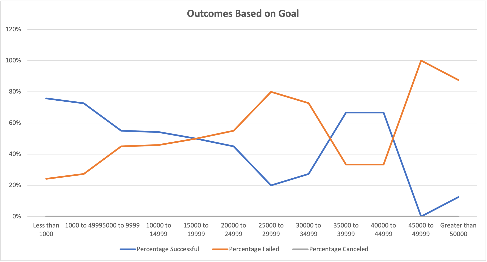
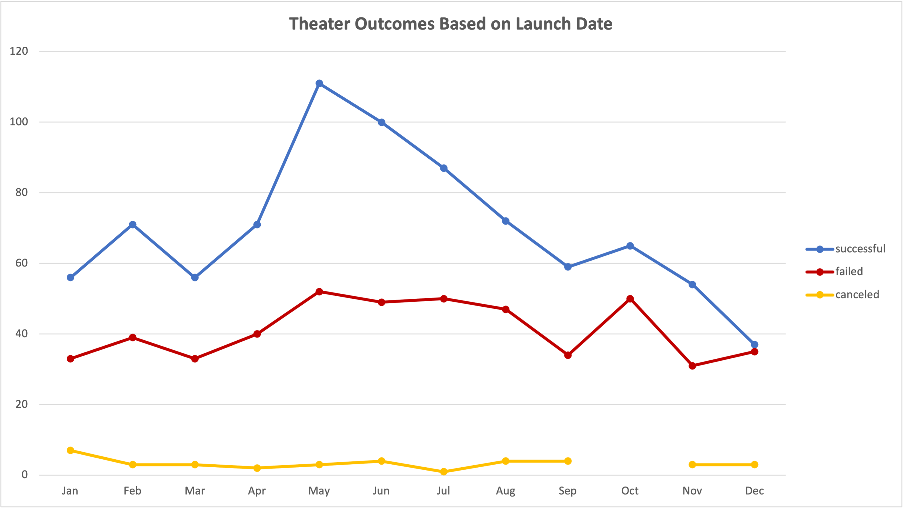

# Kickstarting with Excel

## Overview of Project

### Purpose
The purpose of this analysis is to see how different campaigns fared in relation to their launch dates and their funding goals.
## Analysis and Challenges
Explain how you performed your analysis using images and links to code, as well as any challenges you encountered and how you overcame them. If you had no challenges, describe any possible challenges or difficulties that could be encountered.
### Analysis of Outcomes Based on Launch Date
A separate columnn was created to extract the year from the "Date Created Conversion" column, next a pivot table was created to show data for "theater". Finally, a line chart was created to visualize the relationship between outcomes and launch month.

### Analysis of Outcomes Based on Goals
Several columns were created to show the percentage of successful, failed and canceled projects (plays) relative to their goal. The goal column was created to show the following dollar-amount ranges (less than 1000, 1000 to 4999, 5000 to 9999, 10000 to 14999, 15000 to 19999, 20000 to 24999, 25000 to 29999, 30000 to 34999, 35000 to 39999, 40000 to 44999, 45000 to 49999, and greater than 50000)

### Challenges and Difficulties Encountered
Difficulties for Deliverable 1 included not getting the pivot table to look 
## Results

- What are two conclusions you can draw about the Outcomes based on Launch Date?

- What can you conclude about the Outcomes based on Goals?

- What are some limitations of this dataset?

- What are some other possible tables and/or graphs that we could create?
